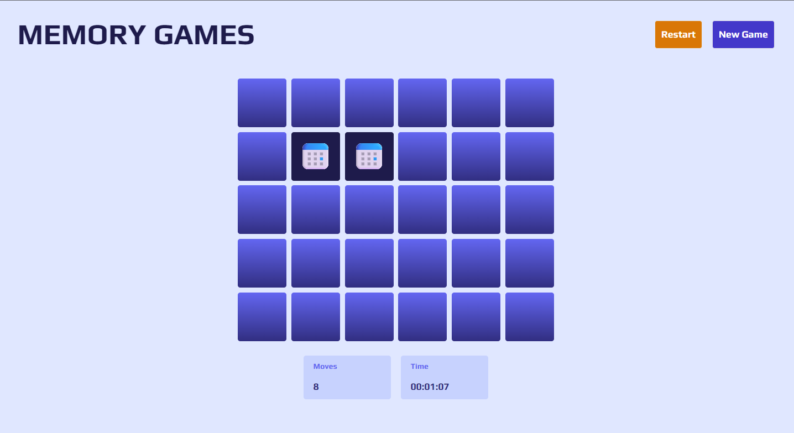

# Memory Game

## [Check it live here](https://memorygames.vercel.app/)



A Memory game made with NextJS 13 and Tailwind and Typescript.

## Getting Started

These instructions will get you a copy of the project up and running on your local machine for development and testing purposes. See deployment for notes on how to deploy the project on a live system.

### Installing

Clone the Repository and run

```
npm install
npm run dev
```

## Deployment

To deploy simply run

```
npm run build
```

Then run

```
npm start
```

## Contributing

Please feel free to send pull request if you want to contribute!
